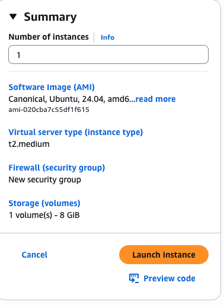
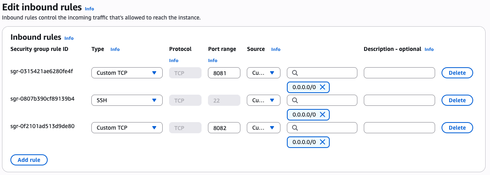
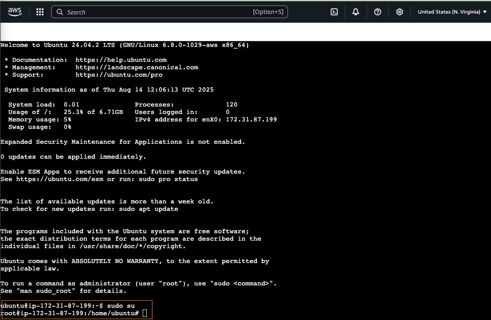
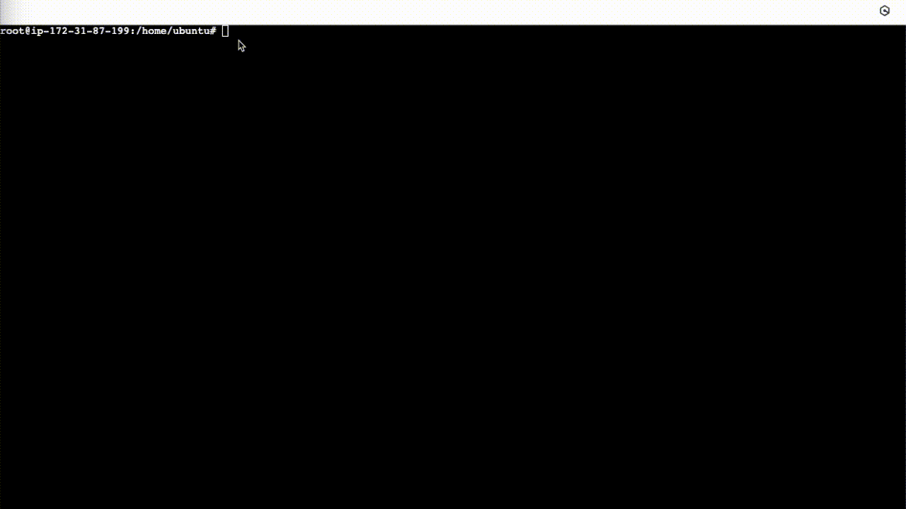

# 🚀 JFrog Artifactory Deployment on AWS EC2 with Docker & Maven

A step-by-step DevOps lab project to **install and configure JFrog Artifactory** on an AWS EC2 instance using Docker, Maven, and Git. This setup is ideal for managing and hosting your build artifacts in a secure and scalable manner.

---

## 📅 Project Summary

In this lab, we will:

- Launch an **AWS EC2 T2.Medium Ubuntu 8GB** instance
- Install and configure **Docker**
- Deploy **JFrog Artifactory OSS** using Docker
- Install **Maven** and **Git**
- Build a sample Java application and upload it to JFrog Artifactory

> **Why?** This project helps you understand how to set up a local artifact repository for your builds, which is a critical component in CI/CD pipelines.

---

## 🛠️ Prerequisites

- An **AWS account** with permissions to launch EC2 instances (t2.medium, 8GB)



- **Security group** allowing inbound traffic on ports `22`, `8081`, and `8082`



- Connect to your instance AWS Console

```bash
sudo su
```

> Change user to root



---

## 🐟 Step 1: Install Docker


```
apt update -y
```

> Updates the package lists for Ubuntu, ensuring you have the latest information about available packages.

```
apt install apt-transport-https ca-certificates curl software-properties-common -y
```

> Installs required dependencies for Docker installation:
>
> - `apt-transport-https` allows fetching packages over HTTPS
> - `ca-certificates` ensures SSL security
> - `curl` for downloading files
> - `software-properties-common` for managing repositories

```
curl -fsSL https://download.docker.com/linux/ubuntu/gpg | apt-key add -
```

> Downloads Docker's official GPG key (`curl -fsSL`) and adds it to your system to verify package authenticity.

```
add-apt-repository "deb [arch=amd64] https://download.docker.com/linux/ubuntu bionic stable" -y
```

> Adds Docker's official stable repository for Ubuntu Bionic (18.04).

```
apt update -y
apt-cache policy docker-ce
```

> Updates package lists again and checks available Docker CE versions.

```
apt install docker-ce -y
```

> Installs **Docker Community Edition**.

```
chmod 777 /var/run/docker.sock
```

> Grants all users full read/write/execute permissions to the Docker socket.

---

## 📦 Step 2: Install & Run JFrog Artifactory OSS



```
usermod -aG docker $USER
```

> Adds your current user to the `docker` group so you can run Docker commands without `sudo`.

```
docker pull docker.bintray.io/jfrog/artifactory-oss:latest
```

> Downloads the latest **JFrog Artifactory OSS** image from JFrog's repository.

```
mkdir -p /jfrog/artifactory
chown -R 1030 /jfrog/
```

> Creates a directory for Artifactory data and assigns ownership to the Artifactory user ID `1030`.

```
docker run --name artifactory -d -p 8081:8081 -p 8082:8082 -v /jfrog/artifactory:/var/opt/jfrog/artifactory docker.bintray.io/jfrog/artifactory-oss:latest
```

> Runs the Artifactory container in detached mode (`-d`), mapping host ports to container ports and mounting the data directory.

**Access JFrog Artifactory:**

```
http://<EC2_IP>:8081/artifactory
```

**Default Login:**

- **Username:** `admin`
- **Password:** `password`

---

## 📁 Step 3: Install Maven

```
apt update -y
apt install maven -y
mvn -version
```

> Installs **Maven**, a Java build automation tool, and verifies the installation.

---

## 🐈 Step 4: Install Git

```
apt update
apt install git -y
git --version
```

> Installs **Git** and verifies the installation.

---

## 🔖 Step 5: Clone Sample Java App

```
git clone https://github.com/mirjSolution/Java-App-Sample-1
```

> Clones the sample Java application repository to your EC2 instance.

---

## 💪 Step 6: Build the Application

```
mvn clean install -DskipTests
```

> Cleans previous build artifacts, compiles the project, and packages it into a JAR file without running tests (`-DskipTests`).

---

## 📦 Step 7: Upload Artifact to JFrog Artifactory

```
curl -X PUT -u <username>:<password> \
  -T kubernetes-configmap-reload-0.0.1-SNAPSHOT.jar \
  http://<EC2_IP>:8082/artifactory/<example-repo-local>
```

> Uploads the JAR file to your JFrog Artifactory repository using HTTP `PUT`.
>
> - `-u` specifies your username and password
> - `-T` specifies the file to upload

---

## 🔗 References

- [Docker Official Documentation](https://docs.docker.com/reference/)
- [JFrog Artifactory OSS Docs](https://jfrog.com/help/r/jfrog-artifactory-documentation/jfrog-artifactory)
- [Apache Maven Documentation](https://maven.apache.org/guides/index.html)
- [Git Documentation](https://git-scm.com/doc)

---

🧑‍💻 _Created by Rico John Dato-on_
🔗 [LinkedIn](https://www.linkedin.com/in/rico-john-dato-on) • [Portfolio](https://ricodatoon.netlify.app)
